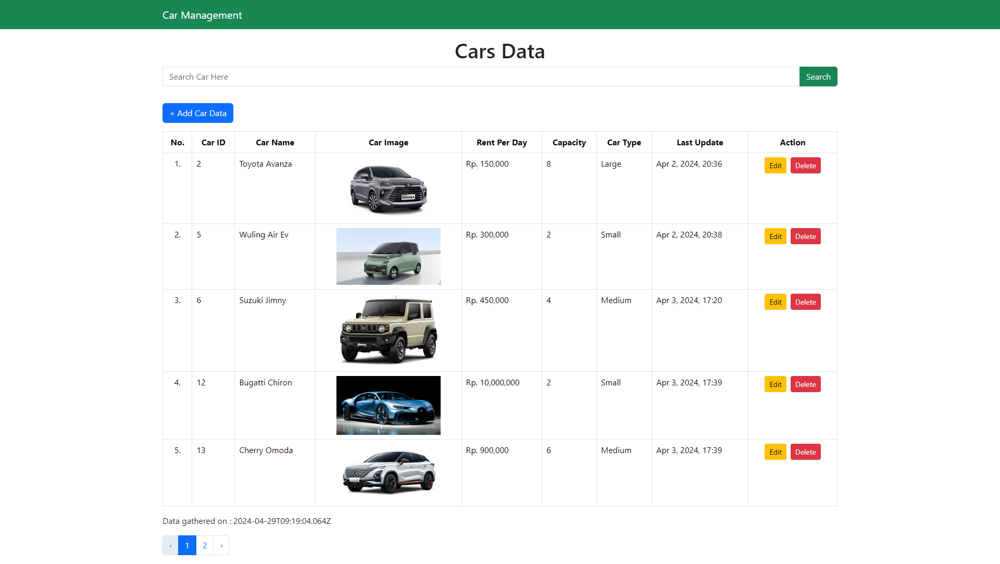
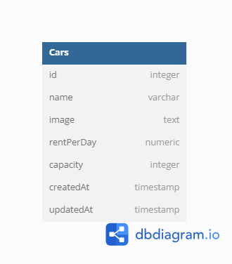

# Individual Daily Task

Create CRUD using React Vite

## Installation

- Clone This Repository
- `npm i`
- `npm run dev`

## Preview

     

## Backend

[Repository](https://github.com/akbarrahmatm/f-fsw24001086-km6-akb-carmanagementdashboard-ch4)

##### Database Structure

     

